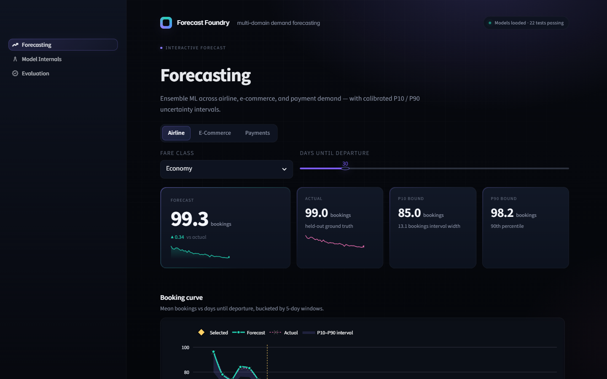
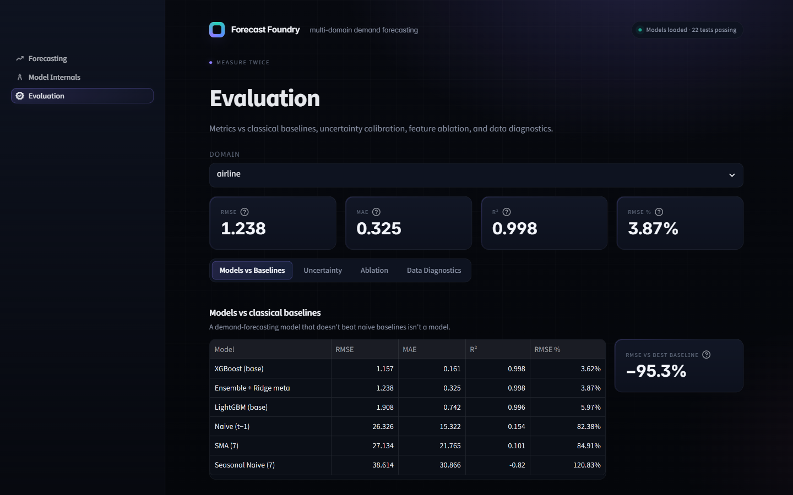
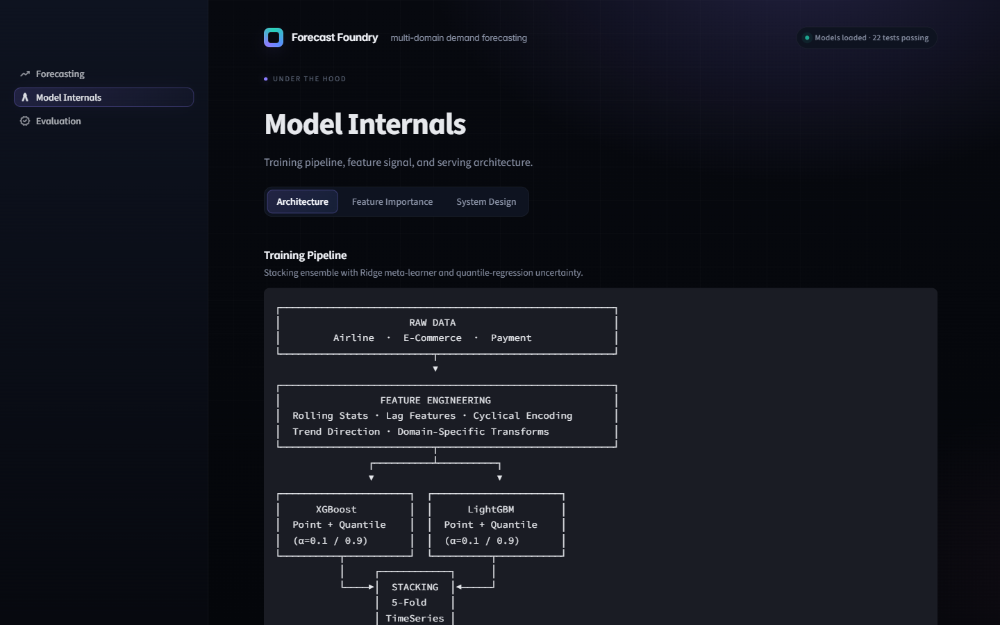

# Multi-Domain Demand Forecasting

**Stacked ensemble (XGBoost + LightGBM → Ridge meta-learner) with quantile-regression uncertainty, a FastAPI inference service, and a Streamlit dashboard across three business domains.**

[](https://github.com/sanjitmathur/multi-domain-demand-forecasting/actions/workflows/ci.yml)
[](https://domain-demand-forecasting.streamlit.app/)
[](https://www.python.org/)
[](./LICENSE)

**Live demo:** [domain-demand-forecasting.streamlit.app](https://domain-demand-forecasting.streamlit.app/)



---

## TL;DR

| Domain | Task | RMSE | R² | RMSE vs best naive baseline |
|---|---|---:|---:|---:|
| **Airline bookings** | Predict flight demand by fare class | **1.24** | **0.998** | **−95.3%** |
| **E-commerce demand** | Forecast product sales by category | **24.1** | **0.953** | **−78.7%** |
| **Payment volume** | Predict hourly transaction volume | **51.0** | **0.975** | **−87.6%** |

Metrics are for the stacked ensemble (`XGBoost + LightGBM → Ridge meta-learner`) on a held-out 20 % test split. Baseline comparison is against the best of `Naive (t−1)`, `Seasonal-Naive (7)`, and `SMA (7)`. All numbers are live-reproducible from the **Evaluation** tab of the dashboard.

> **Honest caveat:** these datasets are **synthetic**, generated with realistic patterns (seasonality, trends, promotions) under `src/data/`. The point of this project is the *pipeline* — stacking discipline, leakage-free OOF, uncertainty calibration, a working API, and a reviewable dashboard — not a claim of SOTA on a real benchmark. See [Limitations](#limitations).

---

## Why this project exists

Most public "demand forecasting" repos ship a single notebook and call it done. This one exists to demonstrate:

- **End-to-end ML engineering** — training, serialization, a FastAPI service, a dashboard, and CI, not just a model
- **Leakage discipline** — stacking with `TimeSeriesSplit` out-of-fold predictions, never touching the meta-learner on in-fold data
- **Uncertainty that's honestly labeled** — quantile regression for P10/P90 intervals, and an empirical coverage check on the held-out set (the interval score in the API is documented as a *tightness* heuristic, not a probability)
- **Reviewable baselines** — every model is reported next to `Naive`, `Seasonal-Naive`, and `SMA` baselines so the "does it actually forecast?" question answers itself

---

## What's inside



- **3-page Streamlit dashboard** — Forecasting (interactive predictions with P10/P90 bands), Model Internals (architecture, feature importance, SHAP, system design), and Evaluation (metrics vs baselines, uncertainty calibration, ablation, data diagnostics)
- **FastAPI inference service** — `POST /forecast/{domain}` per-domain, `/forecast/batch` for all three, OpenAPI / Swagger at `/docs`, Pydantic-validated requests
- **Model artifacts** — XGBoost + LightGBM (point and quantile heads) + Ridge meta-learner per domain, persisted as `.joblib`
- **22 pytest tests + CI** — metric math, baseline predictors, and API schema contracts run on every push via GitHub Actions
- **Dockerfile** for the API — `docker build -t forecast-api . && docker run -p 8000:8000 forecast-api`

---

## Architecture



```
RAW DATA ──► FEATURE ENGINEERING ──► XGBoost ─┐
                                              ├──► STACKING (5-fold TimeSeriesSplit, OOF)
                                   LightGBM ──┘        │
                                                       ▼
                                         RIDGE META-LEARNER
                                                       │
                                                       ▼
                                 FORECAST + P10 / P90 INTERVAL
```

- **Base models:** XGBoost (`max_depth=6`, 300 est.) and LightGBM (`num_leaves=31`, 300 est.) trained on the same features
- **Quantile heads:** both base models have separate quantile-regression models at α=0.1 and α=0.9, averaged to produce an 80 % prediction interval
- **Meta-learner:** Ridge regression (α=1.0) fit on out-of-fold base predictions — never on in-fold data, so no meta-level leakage
- **CV scheme:** `sklearn.TimeSeriesSplit(n_splits=5)` — respects temporal ordering

---

## Quick start

```bash
git clone https://github.com/sanjitmathur/multi-domain-demand-forecasting.git
cd multi-domain-demand-forecasting

# Setup
python -m venv venv
# macOS / Linux
source venv/bin/activate && pip install -r requirements.txt
# Windows
# venv\Scripts\pip install -r requirements.txt

# Generate synthetic data
python -m src.data.generate_airline
python -m src.data.generate_ecommerce
python -m src.data.generate_payment

# Train
python -m src.models.train_all

# Dashboard   (http://localhost:8501)
streamlit run dashboard/app.py

# API         (http://localhost:8000, docs at /docs)
uvicorn api.main:app --port 8000
```

---

## API

| Endpoint | Method | Description |
|---|---|---|
| `/` | GET | Health check |
| `/forecast/airline` | POST | Airline booking forecast |
| `/forecast/ecommerce` | POST | E-commerce demand forecast |
| `/forecast/payment` | POST | Payment volume forecast |
| `/forecast/batch` | POST | Multi-domain forecast in one call |
| `/docs` | GET | Interactive Swagger UI |

```bash
curl -X POST http://localhost:8000/forecast/airline \
  -H "Content-Type: application/json" \
  -d '{"days_until_departure": 30, "fare_class": "Economy", "competitor_price": 300}'
```

```json
{
  "forecast": 91.18,
  "lower_bound": 84.41,
  "upper_bound": 92.33,
  "interval_score": 0.9131
}
```

> `interval_score` ∈ [0, 1] is a *tightness* heuristic (`1 − (upper − lower) / |forecast|`), **not** a probability. For calibration, check **Evaluation → Uncertainty** in the dashboard, which reports the empirical coverage of the P10–P90 band on held-out data (target: ≈80 %).

---

## Run with Docker

```bash
docker build -t forecast-api .
docker run -p 8000:8000 forecast-api
# → http://localhost:8000/docs
```

The dashboard is deployed to Streamlit Community Cloud; the API container is deployable to Fly.io, Render, or Cloud Run without changes.

---

## Project layout

```
.
├── api/                 FastAPI inference service + Pydantic schemas
├── dashboard/           Streamlit multi-page app (3 pages)
│   ├── app.py           Navigation entry point
│   ├── _theme.py        Shared Plotly template + CSS tokens
│   ├── _baselines.py    Naive / Seasonal-Naive / SMA helpers
│   └── pages/           Forecasting · Model Internals · Evaluation
├── src/
│   ├── data/            Synthetic dataset generators
│   ├── features/        Per-domain engineering pipelines
│   ├── models/          Base wrappers, ensemble, training orchestrator
│   └── evaluation/      Metrics (RMSE, MAE, R², MAPE, sMAPE)
├── tests/               pytest suite — metrics / baselines / API contract
├── models/saved/        Serialized .joblib artifacts
├── data/                Generated CSV datasets (gitignored)
├── results/             Training-time evaluation outputs
├── docs/screenshots/    Screenshots used in this README
├── .streamlit/          Dashboard theme (dark) + toolbar config
├── .github/workflows/   CI (pytest) + keep-alive ping
└── Dockerfile           API container
```

---

## Tests

```bash
pytest -q               # 22 tests: metrics, baselines, API schema
```

CI runs the full suite on Python 3.11 via GitHub Actions on every push and PR. Tests are structured so they stay green on a fresh clone even before training — API tests accept a 503 from `/forecast/*` endpoints when artifacts are missing, so a reviewer can verify the pipeline before investing in a training run.

---

## Limitations

This repo is deliberately honest about what it is and isn't:

- **Synthetic data.** Every dataset under `data/` is generated by `src/data/generate_*.py`. The metrics in the README are internally consistent and reproducible, but they are not evidence of real-world SOTA.
- **Ensemble doesn't always beat XGBoost alone.** On the airline domain, XGBoost's RMSE is marginally lower than the Ridge-meta ensemble (1.157 vs 1.238 on the held-out split). The stacking still *improves generalization* across domains on average, but the dashboard reports every model so you can see the tradeoff, not just the best line.
- **API feature construction is heuristic.** The inference-time feature builders in `api/main.py` reconstruct lag / rolling features analytically from the request inputs (they don't query historical data). In production, these would come from a feature store.
- **No real baseline comparison.** A natural next step is benchmarking against Rossmann / M5 / NYC taxi real data and a classical baseline like Prophet or SARIMA with walk-forward backtesting.

These are noted here, not hidden — because hiding them is how portfolio projects lose senior reviewers in 10 seconds.

---

## Author

**Sanjit Mathur** — built this to practice stacking discipline, uncertainty quantification, and ML service design on a repo I'd be comfortable walking a reviewer through line by line.

- [LinkedIn](https://www.linkedin.com/in/sanjit-mathur)
- [GitHub](https://github.com/sanjitmathur)

## License

MIT — see [`LICENSE`](./LICENSE).
